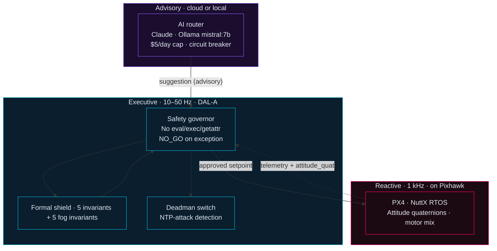

<div align="center">

```
██████╗ ██████╗ ████████╗    ██╗███╗   ██╗ ██████╗
██╔══██╗██╔══██╗╚══██╔══╝    ██║████╗  ██║██╔════╝
██████╔╝██████╔╝   ██║       ██║██╔██╗ ██║██║
██╔══██╗██╔══██╗   ██║       ██║██║╚██╗██║██║
██████╔╝██║  ██║   ██║       ██║██║ ╚████║╚██████╗
╚═════╝ ╚═╝  ╚═╝   ╚═╝       ╚═╝╚═╝  ╚═══╝ ╚═════╝
```

**Charles Bartaria** · Software Engineer & Applied Mathematician  
Manzini, Kingdom of Eswatini · BSc Computer Science & Mathematics (UNESWA 2026)

[](https://brtinc.dev)
[](https://github.com/CBahtaria)
[](https://github.com/CBahtaria)
[](https://github.com/CBahtaria)

</div>

---

## About

I build **production-grade software**: systems with test suites, CI/CD pipelines, security audits, and deployment documentation. Autonomous aerial systems with DAL-A safety discipline. Three-tier architecture combining formal verification, numerical methods, and real-time control.

> The interface IS the model. Operator interfaces compress 6 data signals into the space marketing sites use for one headline.

**Three areas I go deep on:**
- **Security-conscious system design** — auth flows, RBAC, session management, secrets hygiene, OWASP Top 10
- **Production infrastructure** — Docker, Nginx, GitHub Actions, Prometheus/Grafana, Kubernetes
- **Applied mathematics & quantitative methods** — SO(3) Lie groups, ARIMA/SARIMA, Prophet, Monte Carlo simulation, stochastic modeling, Kolmogorov complexity, formal invariants

Available globally via [BRT Inc.](https://brtinc.dev) and [Upwork](https://upwork.com/freelancers/charlesbartaria).

---

## Three-tier architecture (the shape of everything I build)



**Key principle:** The AI never writes to the flight command path. The executive owns final authority. The reactive layer owns hard real-time. This separation is why an LLM can be useful in flight-adjacent systems without being a liability.

---

## Now (week of 2026-07-21)

- **wheels-deals-eswatini** — Full-stack car dealership platform launched. Procedural ASCII highway animation (`AsciiVideoBackground`): 14-char palette, dual Swazi mountain ridges, Manzini city glow, oncoming headlights + tail lights, wet road shimmer, rain overlay; 30 FPS desktop / 20 FPS mobile with adaptive `fontSize`/`FRAME_MS`/resolution, portrait-adaptive horizon, `orientationchange` handler, OffscreenCanvas video-frame sampling path. Thandi AI chat assistant (Haiku 4.5, live Supabase inventory context, finance estimation). Admin vehicle posting (password-gated, `timingSafeEqual` auth, Supabase insert). Media pipeline: magic-byte validation, Supabase Storage, sharp WebP (150/400/800px), EXIF FIFO sort, `media_jobs` queue. Anonymous analytics + scored `PersonalizedFeed`. 4-step UX survey + adaptive engine writing `site_config`. Deployed at [wheels-deals-eswatini.vercel.app](https://wheels-deals-eswatini.vercel.app).
- **brt-inc** (Next.js rebuild) — `EcosystemSection`: 6 cluster cards (UAV/Intelligence/Platform/Gaming/ML/Institutional), IntersectionObserver staggered fade-in, metric pills (13 systems · 8 NATS streams · 1,466+ tests · SRL-6). `About` 2-column: CountUp stats (2021 / 13 / 6 / 1,466+), expertise chips. Services: 7 SVG icons + price hints. Pricing: "Most popular" badge + timelines + `motion.a` CTAs. Portfolio: status badges across all 13 projects. Live at [brtinc.dev](https://brtinc.dev).
- **agentic-uav-stack — SRL-3 HIL gate** — 14 HIL tests passing, 15 correctly skipping (live SITL container). Compliance gate: PASS 30 / FAIL 0. All DAL-A invariants clean. SRL-3 cleared.
- **agentic-uav-stack — Fog water harvesting** — Four mission profiles: boustrophedon survey, hover-collect, net-deploy, swarm (Raft-elected leader). SHT31/visibility/load-cell drivers. Kunkel LWC + Magnus dew-point. Five new DAL-A invariants (wind/mass/gap/tension/battery gates), all `math.isfinite()` guarded. 116 new tests. 942 total.
- **agentic-uav-stack — SO(3) Lie group geometry** — `lie_so3.py`: Rodrigues formula, quaternion exponential (`quat_from_omega`), SLERP, N-dimensional rotation (`nd_rotation_compose`), singularity-free `attitude_quat` replaces Euler angles in `FusedState`. 40 mathematical tests.
- **MahlanyaRPG** — Ship phase complete. 5-tier hardware auto-detection, `UPerformanceAutoTuner`, `UProximityLODSubsystem`, Steam OSS (12 achievements), `USiSwatiLocalizationSubsystem` (70 bilingual strings), Python simulation harness (6 tests). 316 pipeline tests. Pre-launch.

---

## Featured projects

### 🌍 [Mahlanya RPG](https://github.com/CBahtaria/MahlanyaRPG) — public

**Swazi historical 3D RPG** · UE5 C++ · Zig SIMD · Python · Pre-Launch

10 simulation plugins. 10 phases complete + full cross-platform performance system. 316 pipeline tests, 0 regressions.

Earth-science accuracy as a design constraint: 10m Copernicus DEM (Eswatini bounding box, UTM Zone 36S) eroded through 5,000 geomorphological passes — thermal, fluvial, aeolian, mass-wasting — via Zig SIMD `@Vector(8, f32)` kernels compiled to `libmahlanya_compute.so`. D-infinity flow accumulation (Tarboton 1997) extracts 6 river systems. Centroidal Voronoi Tessellation with Swazi social constraint tensors places settlements whose geometry communicates hierarchy without UI text.

| Plugin | What it does |
|---|---|
| `SimulationBusPlugin` | Typed multicast event bus decoupling all plugins |
| `MicroclimateEngine` | Barometric pressure random walk → orographic rainfall → lightning charge accumulation |
| `SibayaEngine` | Runtime Voronoi recompute on demographic events (marriage, cattle raid, family merge) |
| `LocomotionPhysicsPlugin` | Anisotropic friction tensors (8 materials × wet/dry), biomechanical altitude fatigue, Chaos slip |
| `GeometricAudioPlugin` | 64-ray Monte Carlo acoustic ray-caster, Hosek-Wilkie spectral sky LUTs, bioacoustics |
| `EconomySimulatorPlugin` | Cattle-based economy; colonial concession infection; lobola → settlement recompute |
| `EmergentNarrativePlugin` | Threshold-triggered quest generation from simulation state — no hardcoded scripts |
| `EcologySimulatorPlugin` | Lotka-Volterra ODE grid (6 prey–predator pairs), seasonal migration |
| `KnowledgeGraphPlugin` | Historical accuracy constraint graph — structurally prevents false NPC statements |
| `ErosionRuntimePlugin` | GPU compute shader (ErosionCS.usf) on rain events; session-local displacement |

```
UE5 C++ · Zig 0.13+ · Python 3.11 · GDAL · Unreal Insights · Steam SDK 1.58 · ASTC
```

---

### 🔒 [UEDF Sentinel v5.0](https://github.com/CBahtaria/sentinel) — public

**Military command & control platform** · 27,900 lines · PHP 8 + MySQL · production-ready

Real-time drone fleet management and threat detection system. RBAC with 4 roles, TOTP 2FA, blockchain-chained tamper-evident audit log, Node.js WebSocket telemetry shim, NATS JetStream integration.

**Security audit:** 3 Critical + 6 High findings → all 9 resolved · 22 files patched · 317 lines fixed · 0 regressions · audit-gated CI.

```
PHP 8.3 · MySQL 8 · Node.js · NATS JetStream · WebSocket · PHPUnit · GitHub Actions
```

---

### 🛸 [Agentic UAV Stack](https://github.com/CBahtaria/agentic-uav-stack) — private

**Multi-scale autonomous drone platform** · Three-tier architecture · Formal verification · 942 tests

| Layer | Component | Mathematics & Theory |
|---|---|---|
| **Reactive** (1 kHz) | PX4 + NuttX RTOS | Attitude quaternions (SO(3) Lie group), motor mixing matrices, real-time servo control |
| **Executive** (10–50 Hz) | Safety governor + ROS 2 Jazzy + DDS | Formal shield: 5 geometric + 5 fog invariants; NaN → NO_GO; deadman's switch with NTP-attack detection |
| **Advisory** | AI router → Claude / Ollama | Probabilistic decision boundary, human-authorization gating, fog action types |

SRL-3 HIL gate PASSED — 942 unit tests · 14 HIL tests passing. Kardashev 0.68.

**Subsystems shipped:** Brain daemon with key isolation · Simplex formal shield (10 invariants) · Deadman's switch with NTP-attack detection · Octogent multi-agent vulnerability scanner · N-version security divtab · Runtime PEP-578 audit hook · Merkle tamper-evident audit trail · Fog water harvesting (4 mission profiles: survey, hover-collect, net-deploy, swarm) · SHT31/visibility/load-cell sensor drivers · Kunkel LWC + Magnus dew-point fog physics · **SO(3) Lie group geometry** (`shared/geometry/lie_so3.py`): Rodrigues formula, quaternion exponential, SLERP, N-dimensional rotation, singularity-free `attitude_quat` in FusedState · Swarm Raft consensus · RF channel mesh · UAVZ/UAVZMA lossless codecs

```
Python 3.12 · NATS JetStream · MAVLink · ROS 2 Jazzy · DDS · numpy · pytest · GitHub Actions
```

---

### 📊 Eswatini Macroeconomic Dashboard *(UNESWA Dissertation)*

**Economic intelligence system** · FastAPI + Plotly Dash · 54 tests passing · Quantitative Methods

Production-grade backend with 11 endpoint groups, SQLAlchemy ORM, JWT auth (3-tier RBAC). **Forecasting engine:** auto-order ARIMA/SARIMA time-series decomposition, Facebook Prophet with changepoint detection, Monte Carlo fiscal sustainability simulation (10,000 paths, 95% CI bounds). Impulse-response analysis for shock scenarios.

```
Python · FastAPI · Plotly Dash · Prophet · statsmodels · pandas · SQLAlchemy · PostgreSQL · Docker · Nginx · pytest
```

---

### ✂️ [Studio P Barbershop App v3](https://github.com/CBahtaria/studio-p) — public

**Production-grade booking platform** · React 19 + TypeScript + Supabase + Vercel

Live business app deployed for Studio P, Manzini. OS-aware UI via `userAgent`/`platform`/`maxTouchPoints` (applied synchronously, zero layout flash). Two-round orchestrated parallel booking validation flow with conflict detection and real-time slot locking.

```
React 19 · TypeScript · Supabase · PostgreSQL RLS · PBKDF2 · Web Crypto API · Vercel
```

---

### 🌾 [Maize Leaf Classifier](https://github.com/CBahtaria/maize-leaf-classifier) — public

**Binary disease classifier for SSA smallholder farmers** · MobileNetV2 CNN · FastAPI + React PWA

MobileNetV2 fine-tuned on PlantVillage (healthy vs grey-leaf-spot). FastAPI inference endpoint, React PWA with offline support, blue-green Nginx deployment, Docker Compose stack. Targets low-spec smartphones common in SADC agricultural contexts.

```
Python · TensorFlow · FastAPI · React · Docker · Nginx · GitHub Actions
```

---

### ⚡ [Levin Search](https://github.com/CBahtaria/levin-search) — private

**Levin's Universal Search over BrainFuck** · Algorithmic Information Theory · Speed-optimised

Deterministic universal search achieving O(2^|p*| · t*) total work asymptotically — matching Levin's theoretical bound. Three optimizations: incremental execution (O(1) state restore), dead-set pruning (halted programs permanently removed), bracket precomputation (O(1) bracket target resolution).

```
Python · Algorithmic Information Theory · Kolmogorov complexity · prefix-free enumeration
```

---

### 🚗 [Wheels & Deals Eswatini](https://github.com/CBahtaria/wheels-deals-eswatini) — public

**Used car dealership platform** · Next.js 16 + TypeScript + Supabase + Vercel · [wheels-deals-eswatini.vercel.app](https://wheels-deals-eswatini.vercel.app)

Procedural ASCII highway animation: 14-char luminance palette, dual Swazi mountain ridges (composite sine waves), Manzini city glow on right horizon, 3 oncoming headlight cars (delta-time position update), tail lights, wet road shimmer (per-cell Math.sin), roadside billboard, rain system (80 drops, random toggle). Mobile-adaptive: 20 FPS / `fontSize 14px` / 960px cap on mobile vs 30 FPS / 10px / 1920px on desktop; portrait-adaptive horizon; `orientationchange` listener; OffscreenCanvas video-frame sampling path with try/catch for older iOS. Thandi AI chat assistant (Haiku 4.5, live Supabase inventory context, finance calculation). Admin vehicle posting (password gate with `timingSafeEqual`, full form → Supabase insert). Media pipeline: magic-byte header validation, Supabase Storage, sharp WebP (150/400/800px), EXIF DateTimeOriginal FIFO sort, `media_jobs` queue. Anonymous analytics: `crypto.randomUUID` session IDs, `user_events` table, scored `PersonalizedFeed` (+3 body_type, +2 fuel_type, +4 price_range, +3 make). 4-step UX survey (framer-motion slide-up) + adaptive engine writing `site_config` (featured_body_types, layout_mode, cta_prominence).

```
Next.js 16 · TypeScript · Supabase · sharp · framer-motion · Tailwind CSS · Vercel · Anthropic
```

---

### 🌐 [BRT Inc.](https://github.com/CBahtaria/brt-inc) — public

**Operator website + internal toolkit** · [brtinc.dev](https://brtinc.dev) · Next.js 16 App Router + Supabase + Vercel

Auth-gated internal tools: CRM (kanban + table view), proposal generator, service agreement templates, client onboarding intake, Stripe webhook handler, Resend email delivery.

**2026-07-21 Next.js rebuild:** `EcosystemSection` — 6 cluster cards (UAV · Intelligence · Platform · Gaming · ML/Edge · Institutional), IntersectionObserver staggered reveal, colored top accent bars, status dots (LIVE · Building · Phase 11), metric pills (13 systems · 8 NATS streams · 1,466+ tests · SRL-6). `About` 2-column: CountUp stats (2021 / 13 / 6 / 1,466+), expertise chips (DAL-A · SRL-6 · TOTP 2FA · PostGIS · UE5 Nanite · AES-GCM-256). Services: 7 cards with inline SVG icons + price hints + category tags. Pricing: "Most popular" amber badge + timelines + deposit note + `motion.a` CTAs. Portfolio: status badges across all 13 projects.

```
Next.js 16 · TypeScript · Supabase · framer-motion · Tailwind CSS · Vercel · Resend · Stripe
```

---

## Operating principles

1. **No AI in the flight command path.** AI is advisory; formal shield + governor have final say. Engagement recs require human authorization.
2. **DAL-A invariants are CI-gated.** `scripts/check_dal_a_rules.py` rejects `eval`, `exec`, `getattr`, `__import__` in safety-critical files.
3. **Fail-safe means `NO_GO`.** Governor returns NO_GO on exception; NaN sensor readings → NO_GO via `math.isfinite()` guards.
4. **API keys never leave the daemon process.** `brain/daemon.py` loads `.env`, pops secrets, then `subprocess.Popen(..., env={})`. Audit via `make audit-keys`.
5. **Defense in depth at every layer.** SROS2 enclaves enforce topic-level pub/sub authorization at DDS layer.
6. **Multi-persona security review.** 9 concurrent personas (red-team, blue-team, supply-chain, compliance, insider-threat, architecture-integrity, trojan-horse, goldilocks, cat-burglar) run weekly with independent findings consolidated by an LLM synthesis pass.

---

## Tech stack

| Layer | Technologies |
|---|---|
| **Languages** | Python 3.12 · PHP 8 · TypeScript · JavaScript · SQL · C++ · Zig 0.13+ · Bash |
| **Web** | FastAPI · React 19 · Plotly Dash · Flask + Socket.IO · Ratchet WebSocket · SQLAlchemy |
| **Data** | NATS JetStream · PostgreSQL · MySQL 8 · Supabase · SQLite (WAL + FTS5) · DuckDB · Qdrant |
| **DevOps** | Docker Compose · Kubernetes + MicroShift · Helm · Nginx · GitHub Actions · Prometheus · Grafana · Ansible |
| **ML / Forecasting** | ARIMA/SARIMA · Prophet · Monte Carlo · pandas · scikit-learn · GGUF quantization |
| **Mathematics** | SO(3)/SO(n) Lie groups · Rodrigues formula · quaternion exponential · SLERP · time-series decomposition · stochastic modeling · Kunkel/Magnus fog physics · Kolmogorov complexity · formal verification |
| **Security** | OWASP Top 10 · RBAC · JWT · PBKDF2 · 2FA/TOTP · SROS2 DDS Security · TPM 2.0 · cosign · NTS-NTP · MAVLink 2 signing |
| **Game / UE5** | Unreal Engine 5 · GAS · World Partition · Nanite · Lumen · MetaSounds · Chaos Physics · PCG Framework · Unreal Insights |
| **Testing** | PHPUnit · pytest (942 tests on UAV stack) · stress testing · integration tests · GitHub Actions CI |
| **Runtime** | ROS 2 Jazzy · NuttX RTOS · Linux (Fedora dev, RHEL9, Jetson Orin) · systemd |
| **AI** | Claude Sonnet/Opus ($5/day cap) · Ollama mistral:7b-q4 · hybrid router + circuit breaker · SFT · RLVR · distillation |
| **UI** | React/JSX · BARTARIA TAC-OS v5 design tokens · Doto + Iceland + DM Sans + JetBrains Mono · r3f + shadergradient |

---

## Audience

I write so the next operator can pick this up cold. National Libraries, government officials, defence forces are the design audience for the compliance posture. Repos and docs reflect that — read `agentic-uav-stack/CLAUDE.md` or `sentinel/SECURITY.md` for the standard.

---

## What I am not

Not a content marketer. Not a vibe-coder. Not a wrapper around someone else's API. Work targets compliance gates before features, not after; tamper-evident audit before "observability"; deterministic behaviour at system boundaries before probabilistic behaviour in the interior.

---

## Contact

**Building something that needs a solid engineer?**

**[BRT Inc.](https://brtinc.dev)** · hello@brtinc.dev · [Upwork](https://upwork.com/freelancers/charlesbartaria)

> *"Every project ships with a test suite, CI/CD pipeline, and deployment documentation — not just working code."*

Through the issue tracker on any repo above. No DMs on other platforms.
