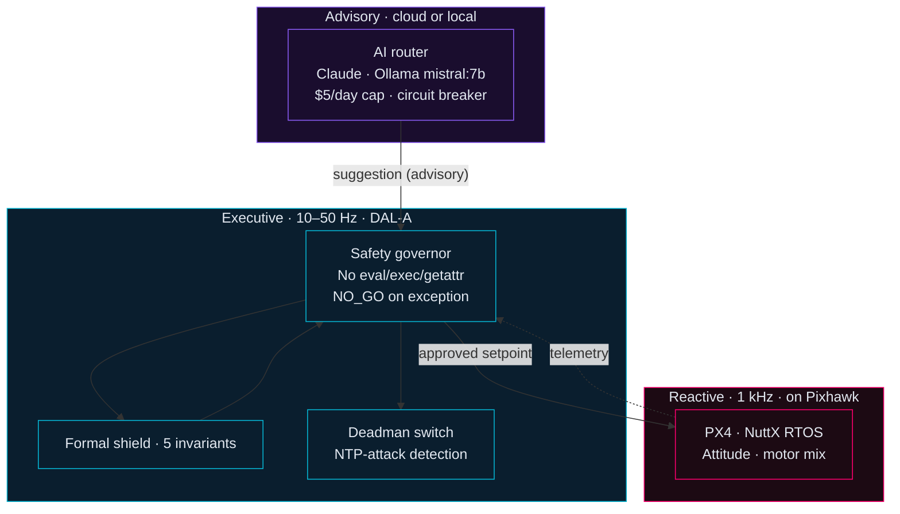

<div align="center">

```
██████╗ ██████╗ ████████╗    ██╗███╗   ██╗ ██████╗
██╔══██╗██╔══██╗╚══██╔══╝    ██║████╗  ██║██╔════╝
██████╔╝██████╔╝   ██║       ██║██╔██╗ ██║██║
██╔══██╗██╔══██╗   ██║       ██║██║╚██╗██║██║
██████╔╝██║  ██║   ██║       ██║██║ ╚████║╚██████╗
╚═════╝ ╚═╝  ╚═╝   ╚═╝       ╚═╝╚═╝  ╚═══╝ ╚═════╝
```

**Charles Bartaria** · Software Engineer & Applied Mathematician  
Manzini, Kingdom of Eswatini · BSc Computer Science & Mathematics (UNESWA 2026)

[](https://brtinc.dev)
[](https://github.com/CBahtaria)
[](https://github.com/CBahtaria)
[](https://github.com/CBahtaria)

</div>

---

## About

I build **production-grade software**: systems with test suites, CI/CD pipelines, security audits, and deployment documentation. Autonomous aerial systems with DAL-A safety discipline. Three-tier architecture combining formal verification, numerical methods, and real-time control.

> The interface IS the model. Operator interfaces compress 6 data signals into the space marketing sites use for one headline.

**Three areas I go deep on:**
- **Security-conscious system design** — auth flows, RBAC, session management, secrets hygiene, OWASP Top 10
- **Production infrastructure** — Docker, Nginx, GitHub Actions, Prometheus/Grafana, Kubernetes
- **Applied mathematics & quantitative methods** — ARIMA/SARIMA time-series analysis, Prophet forecasting, Monte Carlo simulation, stochastic modeling, complexity analysis (Kolmogorov, algorithmic information theory), formal invariants

Available globally via [BRT Inc.](https://brtinc.dev) and [Upwork](https://upwork.com/freelancers/charlesbartaria).

---

## Three-tier architecture (the shape of everything I build)



**Key principle:** The AI never writes to the flight command path. The executive owns final authority. The reactive layer owns hard real-time. This separation is why an LLM can be useful in flight-adj[...]

---

## Now (week of 2026-06-04)

- **sentinel** — Audit closed (9/9 findings resolved). BRT Inc. launched with UEDF SENTINEL v5.0 in production.
- **agentic-uav-stack** — Tier 1+2+3 wave stable on `main`. SRL-3 HIL ramping. 783 tests passing.
- **levin-search** — Shipped. Levin Universal Search over BrainFuck with O(2^|p*| · t*) total work. Kolmogorov complexity bounds verified.
- **second-brain** — Ingestion pipeline iteration. Qdrant + ONNX embedding server next.

---

## Featured projects

### 🔒 [UEDF Sentinel v5.0](https://github.com/CBahtaria/sentinel) — public

**Military command & control platform** · 27,900 lines · PHP 8 + MySQL · production-ready

Real-time drone fleet management and threat detection system. RBAC with 4 roles, TOTP 2FA, blockchain-chained tamper-evident audit log, Node.js WebSocket telemetry shim, NATS JetStream integration. Si[...]

**Security audit:** 3 Critical + 6 High findings → [all 9 resolved](https://github.com/CBahtaria/sentinel/blob/main/SECURITY.md) · 22 files patched · 317 lines fixed · 0 regressions · audit-gate[...]

```
PHP 8.3 · MySQL 8 · Node.js · NATS JetStream · WebSocket · PHPUnit · GitHub Actions
```

---

### 🛸 [Agentic UAV Stack](https://github.com/CBahtaria/agentic-uav-stack) — private

**Multi-scale autonomous drone platform** · Three-tier architecture · Formal verification

| Layer | Component | Mathematics & Theory |
|---|---|---|
| **Reactive** (1 kHz) | PX4 + NuttX RTOS | Attitude quaternions, motor mixing matrices, real-time servo control |
| **Executive** (10–50 Hz) | Safety governor + ROS 2 Jazzy + DDS | Formal shield: 5 geometric invariants, deadman's switch with NTP-attack detection, fail-safe semantics |
| **Advisory** | AI router → Claude / Ollama | Probabilistic decision boundary, human-authorization gating |

Currently SRL-3, HIL ramping. 783 tests passing. Kardashev 0.68.

**Subsystems shipped:** Brain daemon with key isolation; Simplex formal shield (5 geometric invariants); deadman's switch with NTP-attack detection; Octogent multi-agent vulnerability scanner; N-versi[...]

```
Python 3.12 · NATS JetStream · MAVLink · ROS 2 Jazzy · DDS · pytest · GitHub Actions
```

---

### 📊 Eswatini Macroeconomic Dashboard *(UNESWA Dissertation)*

**Economic intelligence system** · FastAPI + Plotly Dash · 54 tests passing · Quantitative Methods

Production-grade backend with 11 endpoint groups, SQLAlchemy ORM, JWT auth (3-tier RBAC). **Forecasting engine:** auto-order ARIMA/SARIMA time-series decomposition, Facebook Prophet with changepoint detection, Monte Carlo fiscal sustainability simulation (10,000 paths, 95% CI bounds). Impulse-response analysis for shock scenarios.

```
Python · FastAPI · Plotly Dash · Prophet · statsmodels · pandas · SQLAlchemy · PostgreSQL · Docker · Nginx · pytest
```

---

### ✂️ [Studio P Barbershop App v3](https://github.com/CBahtaria/studio-p) — public

**Production-grade booking platform** · React 19 + TypeScript + Supabase + Vercel

Live business app deployed for Studio P, Manzini. OS-aware UI via `userAgent`/`platform`/`maxTouchPoints` (applied synchronously, zero layout flash). Two-round orchestrated parallel booking validation[...]

```
React 19 · TypeScript · Supabase · PostgreSQL RLS · PBKDF2 · Web Crypto API · Vercel
```

---

### ⚡ [Levin Search](https://github.com/CBahtaria/levin-search) — private

**Levin's Universal Search over BrainFuck** · Algorithmic Information Theory · Speed-optimised

Deterministic universal search algorithm over programs in an esoteric language. Achieves O(2^|p*| · t*) total work asymptotically — matching Levin's theoretical bound. **Mathematical foundations:** Kolmogorov complexity, prefix-free enumeration, halting problem bounds.

Three optimizations:

| # | Modification | Effect | Theory |
|---|---|---|---|
| 1 | **Incremental execution** | Programs resume from checkpoint — zero re-computation | Memoization with O(1) state restore |
| 2 | **Dead-set pruning** | Halted/errored programs removed permanently | Irreversible halt detection → search space reduction |
| 3 | **Bracket precomputation** | O(1) bracket target resolution | Prefix trie on execution stack |

Phase 6 ≈ 60 MB RAM, phase 8 ≈ 3.8 GB. CLI: `find <target>`, `run <program>`, `kolmogorov <target>`.

---

### 🗜️ [Production Compression Framework](https://github.com/CBahtaria/production-compression-framework) — private

Production-grade compression pipeline: adaptive streaming, multi-codec orchestration, edge-deployed. Shell + infrastructure tooling for high-throughput data reduction at the edge of the UAV sensor pip[...]

---

### 🧠 [Second Brain](https://github.com/CBahtaria/second-brain) — private

Obsidian-style knowledge vault. 29 cross-linked wiki articles + 28 studio agents compounding knowledge via per-session `## Evolution Log` entries. Karpathy-style synthesis pipeline (`<scratchpad>` bef[...]

---

## Operating principles

1. **No AI in the flight command path.** AI is advisory; formal shield + governor have final say. Engagement recs require human authorization.
2. **DAL-A invariants are CI-gated.** `scripts/check_dal_a_rules.py` rejects `eval`, `exec`, `getattr`, `__import__` in safety-critical files.
3. **Fail-safe means `NO_GO`.** Governor returns NO_GO on exception; decision variables pre-bound before try block.
4. **API keys never leave the daemon process.** `brain/daemon.py` loads `.env`, pops secrets, then `subprocess.Popen(..., env={})`. Audit via `make audit-keys`.
5. **Defense in depth at every layer.** SROS2 enclaves enforce topic-level pub/sub authorization at DDS layer.
6. **Multi-persona security review.** 9 concurrent personas (red-team, blue-team, supply-chain, compliance, insider-threat, architecture-integrity, trojan-horse, goldilocks, cat-burglar) run weekly wi[...]

---

## Tech stack

| Layer | Technologies |
|---|---|
| **Languages** | Python 3.12 · PHP 8 · TypeScript · JavaScript · SQL · C++ · Bash |
| **Web** | FastAPI · React 19 · Plotly Dash · Flask + Socket.IO · Ratchet WebSocket · SQLAlchemy |
| **Data** | NATS JetStream · PostgreSQL · MySQL 8 · Supabase · SQLite (WAL + FTS5) · DuckDB · Qdrant |
| **DevOps** | Docker Compose · Kubernetes + MicroShift · Helm · Nginx · GitHub Actions · Prometheus · Grafana · Ansible |
| **ML / Forecasting** | ARIMA/SARIMA · Prophet · Monte Carlo · pandas · scikit-learn · GGUF quantization |
| **Mathematics** | Time-series decomposition · Stochastic modeling · Complexity theory (Kolmogorov, algorithmic information) · Formal verification · Quaternion algebra (attitude control) |
| **Security** | OWASP Top 10 · RBAC · JWT · PBKDF2 · 2FA/TOTP · SROS2 DDS Security · TPM 2.0 · cosign · NTS-NTP · MAVLink 2 signing |
| **Testing** | PHPUnit · pytest · stress testing · integration tests · GitHub Actions CI |
| **Runtime** | ROS 2 Jazzy · NuttX RTOS · Linux (Fedora dev, RHEL9, Jetson Orin) · systemd |
| **AI** | Claude Sonnet/Opus ($5/day cap) · Ollama mistral:7b-q4 · hybrid router + circuit breaker · SFT · RLVR · distillation |
| **UI** | React/JSX · Babel on CDN · BARTARIA TAC-OS v5 design tokens · Doto + Iceland + DM Sans + JetBrains Mono · r3f + shadergradient |

---

## Audience

I write so the next operator can pick this up cold. National Libraries, government officials, defence forces are the design audience for the compliance posture. Repos and docs reflect that — read `a[...]

---

## What I am not

Not a content marketer. Not a vibe-coder. Not a wrapper around someone else's API. Work targets compliance gates before features, not after; tamper-evident audit before "observability"; deterministic [...]

---

## Contact

**Building something that needs a solid engineer?**

**[BRT Inc.](https://brtinc.dev)** · hello@brtinc.dev · [Upwork](https://upwork.com/freelancers/charlesbartaria)

> *"Every project ships with a test suite, CI/CD pipeline, and deployment documentation — not just working code."*

Through the issue tracker on any repo above. No DMs on other platforms.
